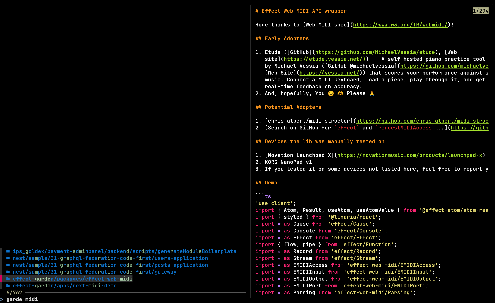
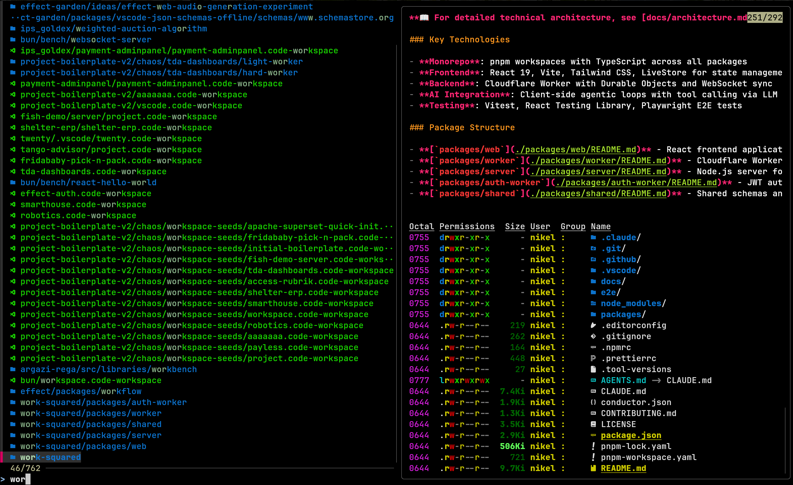

# @evadev/qcode

A keyboard-shortcut-triggered fuzzy project opener for VS Code or shell. It
recursively scans `~/projects` for project roots (detected via `.git`,
`.vscode`, `package.json`, `mise.toml`, or `.code-workspace` files) while
skipping noisy dirs like `node_modules`, `dist`, etc. The results are piped into
`fzf` with a live preview panel that shows the project's README (via `bat`) and
a rich directory listing (via `eza`). Selecting an entry opens it with the
configured opener.

**Runtime dependencies:** `fzf`, `eza`, `bat`. Optionally `bfs` for faster
directory traversal (falls back to `find`).

To install only `node_module` deps (the binaries from above must be present):

```bash
bun install
```

To use:
```bash
# I assigned a keybinding in GNOME to ctrl+alt+r
kitty --single-instance /home/nikel/.local/share/mise/installs/bun/latest/bin/bun /home/evadev/projects/effect-garden/one-offs/qcode/dist/minified/index.mjs

# or a shorter version if you want to see the result without build step
bun index.ts
```

## Openers

The default command (no subcommand) accepts an `--opener` flag that controls
what happens with the project selected in `fzf`:

```bash
# default: open the selected project in VS Code (`code <projectPath>`)
bun index.ts --opener vscode

# drop into an interactive shell rooted at the selected project,
# in the same terminal window
bun index.ts --opener shell
```

- `vscode` (default): launches `code` with the resolved project path and exits.
  Requires the `code` binary on `PATH`.
- `shell`: spawns `$SHELL` (falls back to `bash`) with stdio inherited and `cwd`
  set to the resolved project directory, so you stay in the same terminal
  window. If the selection is a `.code-workspace` file, `cwd` is its parent
  directory. The shell runs until you exit it, then `qcode` exits 0.

Running the bundled and minified version produces the fastest startup times.

Build and minify with `bun run build`

## Demo

|  |  |
| ----------------------------- | ----------------------------- |
